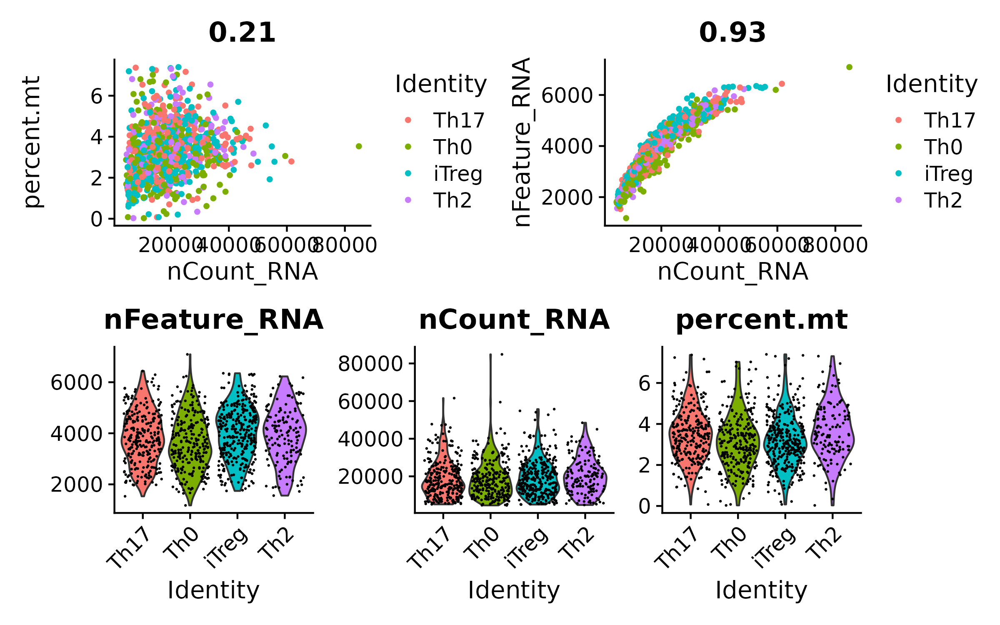

## Week4 assignment


Clone the [dea_seurat](https://github.com/roblehmann/dea_seurat) repository and add rules to make QC plots by revising the snakemake code.

### Steps followed

 1. Create Seurat object using the data provided in the `test_data` folder using the following code
 ```r
 library(Seurat)
 counts<-readRDS("test_data/Naive_Tcells_counts.rds")
meta<-read.csv("test_data/Naive_Tcells_metadata.csv", row.names = 1)
su<-CreateSeuratObject(counts = counts, meta.data = meta)

su <- NormalizeData(su)
su <- FindVariableFeatures(su, selection.method = "vst", nfeatures = 2000)
saveRDS(su,"test_data/Seurat_Naive_Tcells_counts.rds")
 ```
 2. Edit the files present in the `config` folder and rename them from  `config_example.yaml` to `config.yaml` and `annotation_example.csv` to  `annotation.csv`. The annotation file example is shown below:

| name           | data                                                                                         | assay | metadata           | control |
| -------------- | -------------------------------------------------------------------------------------------- | ----- | ------------------ | ------- |
| Rohit_test_run | /home/subudhak/data/coursework2024/week4/dea_seurat/test_data/Seurat_Naive_Tcells_counts.rds | RNA   | cytokine.condition | ALL     |

and the changes made in config files were as follows:

```
##### GENERAL #####
annotation: /home/subudhak/data/coursework2024/week4/dea_seurat/config/annotation.csv
result_path: /home/subudhak/data/coursework2024/week4/dea_seurat/rohit_test_result
```
3. Now that our data is ready, we will write R code to make QC plots using Seurat functions and name this file `qcplots.R`. This file will live inside `workflow/scripts/` where other `.R` files reside. We see that the developer provided a custom `ggsave_new` function in R so we will use that to save our plots. Once you test the code in R and are satisfied that the code generates desirable results, we will write rules `.smk` file.

4. We will name our file `qcplots.smk` file, which will tell Snakemake where to look for `qcplots.R`. We also observe that the workflow has `envs` folder that enable user to use conda environments. We will add `r-ggplot` dependency to `seurat.yaml` file since `%+replace% ` used by the custom `ggsave_new` function requires the user to load the ggplot2 library. 

5. Finally, we will make changes in `Snakefile` where we will add the following block of code under `input` rule:

```
dea_qcplots = expand(os.path.join(result_path,'{analysis}','plots','DEA_qcplot.png'),
                            analysis = analyses,
                           ),
``` 
and will inform Snakemake to load the rules using

```
include: os.path.join("rules", "qcplots.smk")
```

Once this is done, we can rerun our workflow using `snakemake --cores 10`.

The output directory will look like:

```bash
rohit_test_result/
├── configs
│   └── dea_seurat
│       ├── MyData_annot.csv
│       └── MyData_config.yaml
├── dea_seurat
│   └── Rohit_test_run
│       ├── DEA_ALL_stats.csv
│       ├── DEA_FILTERED_LFC.csv
│       ├── DEA_FILTERED_stats.csv
│       ├── DEA_results.csv
│       ├── feature_lists
│       │   ├── ALL_features.txt
│       │   ├── iTreg_down_features.txt
│       │   ├── iTreg_featureScores.csv
│       │   ├── iTreg_up_features.txt
│       │   ├── Th0_down_features.txt
│       │   ├── Th0_featureScores.csv
│       │   ├── Th0_up_features.txt
│       │   ├── Th17_down_features.txt
│       │   ├── Th17_featureScores.csv
│       │   ├── Th17_up_features.txt
│       │   ├── Th2_down_features.txt
│       │   ├── Th2_featureScores.csv
│       │   └── Th2_up_features.txt
│       └── plots
│           ├── DEA_ALL_stats.png
│           ├── DEA_FILTERED_stats.png
│           ├── DEA_LFC_heatmap.png
│           ├── DEA_qcplot.png
│           └── DEA_volcanos.png
└── envs
    └── dea_seurat
        ├── ggplot.yaml
        ├── heatmap.yaml
        ├── seurat.yaml
        └── volcanos.yaml

8 directories, 28 files
```
And the qcplots.R will produce the image given below:



The other plots generated by `dea_seurat` are given in the NaiveTCells.pdf
